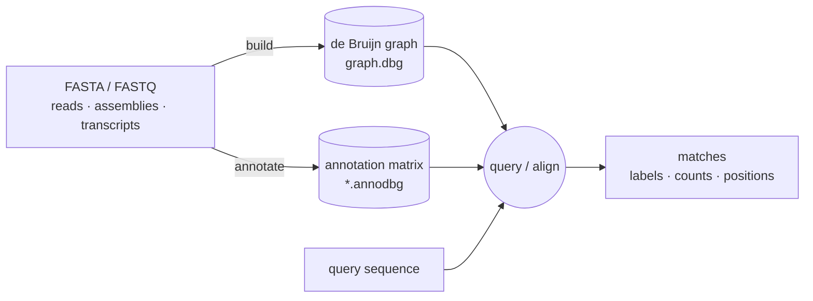

<p align="center">
  
</p>

[](#-quick-start)
[](https://github.com/ratschlab/metagraph/releases)
[](https://bioconda.github.io/recipes/metagraph/README.html)
[](https://bioconda.github.io/recipes/metagraph/README.html)
[](#1-install)
[](#-docker)
[](#install-from-sources)
[](https://doi.org/10.1038/s41586-025-09603-w)
[](https://metagraph.ethz.ch/static/docs/index.html)

**Scalable indexing and querying of annotated genome graphs — from a handful of genomes to petabase-scale sequence repositories.**

Think of MetaGraph as a search engine for sequencing data: index your reads or assemblies once, then query, align, or recover source positions in milliseconds.

A MetaGraph index has two components: a **de Bruijn graph** that stores all *k*-mers extracted from the input sequences, and an **annotation matrix** that links each *k*-mer to its source labels (sample, sequence header, expression level, position, …).



### Features

- 🌐 **Search in public archives.** [metagraph.ethz.ch](https://metagraph.ethz.ch) hosts a search engine over 56 petabases of public sequencing data — see [MetaGraph Online](#-metagraph-online).
- 🏗️ **Index your own data.** Build a *k*-mer index over reads, assemblies, or transcripts; query for matching labels.
- 🔢 **Optional per-*k*-mer payloads.** Attach [counts](https://metagraph.ethz.ch/static/docs/quick_start.html#index-k-mer-counts) (abundance, e.g. expression or coverage) or [coordinates](https://metagraph.ethz.ch/static/docs/quick_start.html#index-k-mer-coordinates) (positions — losslessly encode source sequences and return per-target hit positions).
- 🧬 **Sequence alignment.** Align sequences to the full annotated graph, with sub-*k* seeding for arbitrarily short queries.
- 🧹 **Scalable graph cleaning.** Strip sequencing errors out of very large de Bruijn graphs.
- 🔀 **[Differential assembly](https://metagraph.ethz.ch/static/docs/sequence_assembly.html#differential-assembly).** Extract sequences present in one group of samples and absent from another.
- ☁️ **[Python API & HTTP server](https://metagraph.ethz.ch/static/docs/api.html).** Drive MetaGraph from Python or query a running instance over HTTP.

<details>
<summary>Under the hood</summary>

- **Succinct data structures** — the default `succinct` (BOSS) graph representation uses only 2–4 bits per *k*-mer.
- **Modular annotation formats** — `ColumnCompressed`, `RowDiff<Multi-BRWT>`, `RowSparse`, `Rainbowfish`, plus count- and coordinate-aware variants. Pick the compression/speed tradeoff that fits your scale.
- **Custom alphabets** — `{A,C,G,T}`, `{A,C,G,T,N}`, amino acids, case-sensitive DNA, or compile-time custom alphabets.
- **Memory-mapped loading** — pass `--mmap` to any subcommand for fast cold start and low query-time RAM (NVMe recommended; SSD works but slower).
- **Scales to trillions of *k*-mers and millions of labels** — petabase-scale collections have been indexed end-to-end.

</details>

> 📖 **Full documentation:** <https://metagraph.ethz.ch/static/docs/index.html> &nbsp;·&nbsp; Offline: [`metagraph/docs/source`](metagraph/docs/source)

## 🌐 MetaGraph Online

Try MetaGraph without installing anything: <https://metagraph.ethz.ch/search> hosts a search engine over indexes built from 56 petabases of public DNA, RNA, and protein sequencing data — RefSeq, UHGG, Tara Oceans, UniParc, and more (see the [databases list](https://metagraph.ethz.ch/indexes)). Paste a query sequence and pick the indexes to search.

Prefer local analysis? The prebuilt indexes are also published on [AWS Open Data](https://registry.opendata.aws/metagraph/) for download (no AWS account needed) and offline querying — see [Preconstructed indexes](https://metagraph.ethz.ch/static/docs/resources.html#preconstructed-indexes).

## 🚀 Quick start

### 1. Install

```bash
conda create -n metagraph python
conda activate metagraph
conda install -c bioconda -c conda-forge metagraph
pip install --force-reinstall "git+https://github.com/ratschlab/metagraph.git#subdirectory=metagraph/workflows"
```

`metagraph` is the compiled binary; `metagraph-workflows` is the Python wrapper that drives the full build pipeline.

### 2. Build an index

Clone the repo for the bundled test data, then build:

```bash
# Only to fetch the bundled example *.fa files — skip this if you have your own data
git clone https://github.com/ratschlab/metagraph.git && cd metagraph

metagraph-workflows build <(ls metagraph/tests/data/*.fa) -o out/ --primary
```

`--primary` indexes one strand per *k*-mer pair (about half the size; appropriate when read strand orientation is unknown, e.g. typical short-read sequencing).

Internally this chains `metagraph build → annotate → row-diff transform → BRWT clustering → BRWT relaxation` and produces `graph.dbg`, the more compact `graph_small.dbg` (smaller, slower at access — useful when RAM or storage is tight), and the default annotation `graph.relax.row_diff_brwt.annodbg` (`RowDiff<Multi-BRWT>`). See the [Quick start guide](https://metagraph.ethz.ch/static/docs/quick_start.html) in the docs for a step-by-step of index construction.

<details>
<summary>Real-workload example with file list and hardware budget</summary>

```bash
metagraph-workflows build samples.txt -o out/ --primary \
  -p 34 --mem-gb 70 --disk-swap-dir /scratch/swap
```

The positional argument accepts a file list (one path per line), a directory, or process substitution. Per-stage memory caps, thread packing, and BRWT parameters are derived from the budget. See `metagraph-workflows build --help` for all options.

</details>

### 3. Query

Query the index (any fasta works as input — the bundled test data is fine for a smoke test):

```bash
metagraph query --query-mode matches -p 8 \
    -i out/graph.dbg -a out/graph.relax.row_diff_brwt.annodbg \
    metagraph/tests/data/transcripts_100.fa
```

Other ways to use the index: [`metagraph align`](https://metagraph.ethz.ch/static/docs/sequence_search.html#sequence-to-graph-alignment) for sequence-to-graph alignment (acts as a read mapper when given a coordinate-aware annotator); `metagraph query --align` to find labels via alignment scoring instead of exact *k*-mer matching (useful for divergent or noisy queries); [`metagraph server_query`](https://metagraph.ethz.ch/static/docs/api.html) for Python/HTTP queries. The [Minimal example](#minimal-example) below walks through each step on a smaller dataset.

## Minimal example

<details>
<summary>Step-by-step walkthrough with the <code>metagraph</code> CLI (build → annotate → query → stats)</summary>

A hands-on demo using `metagraph` directly (no workflow wrapper). A *label* is whatever tag you want each *k*-mer associated with — a filename, a fasta header, or a custom string. `--anno-header` below produces one label per fasta record.

```bash
cd metagraph/tests/data

# 1. Build a de Bruijn graph (k-mer index) with k=31
metagraph build -v -p 4 -k 31 -o samples metasub_fake_data_simple.fa

# 2. Construct an annotation matrix linking each k-mer to its source label.
metagraph annotate -v -p 4 -i samples.dbg --anno-header \
                   -o samples metasub_fake_data_simple.fa

# 3. Query: for each query sequence, report all labels whose k-mers cover ≥80% of it.
metagraph query --query-mode matches \
                -i samples.dbg -a samples.column.annodbg \
                --min-kmers-fraction-label 0.8 \
                metasub_fake_data_simple.fa

# 4. Print graph + annotation stats.
metagraph stats -a samples.column.annodbg samples.dbg
```

Outputs `samples.dbg` (the de Bruijn graph) and `samples.column.annodbg` (3 labels, one per fasta record). Sample query output (tab-separated: query index, query header, then one `<label>:k-mer-count` entry per matching label):

```
0   kl_sample   <kl_sample>:330
1   zh_sample   <kl_sample>:243   <zh_sample>:243
2   tk_sample   <kl_sample>:207   <tk_sample>:207
```

Each query matches at least its own label. `zh_sample`'s 243 *k*-mers are fully contained in `kl_sample` (243/243), and same for `tk_sample` (207/207) — they share enough content to clear the 80% threshold. `kl_sample` matches only itself: its 330 *k*-mers aren't fully covered by either of the shorter samples.

</details>

## 🔧 More recipes

<details>
<summary>Direct CLI: align / assemble / differential assembly / stats</summary>

```bash
# Build a de Bruijn graph from a fasta (single sample)
metagraph build -v -p 8 -k 31 --mem-cap-gb 10 -o graph data.fa.gz

# Build using disk swap (limits RAM at the cost of disk I/O)
metagraph build -v -p 8 -k 31 --mem-cap-gb 10 --disk-swap /scratch/swap -o graph data.fa.gz

# Annotate a graph with file-based labels (one label per input file)
metagraph annotate -v -p 8 --anno-filename -i graph.dbg -o annotation data.fa.gz

# Align sequences to the graph (plain sequence-to-graph alignment, no labels).
metagraph align -v -i graph.dbg query.fa

# Labeled alignment: with -a, the walk is label-trace-consistent — every
# k-mer of the reported path lies in every reported label.
metagraph align -v -i graph.dbg -a annotation.row_diff_brwt.annodbg reads.fq

# Same, but with a coordinate-aware annotator: the walk is additionally
# coordinate-consistent (positions step by ±1 per node), so hits map to
# source positions. Functions as a read mapper over indexed genomes.
metagraph align -v -i graph.dbg -a annotation.row_diff_brwt_coord.annodbg reads.fq

# query --align: aligns each query to the graph WITHOUT label constraints,
# then fetches labels for the highest-scoring walk. Use when exact k-mer
# matching is too strict (divergent or noisy queries).
metagraph query --align -i graph.dbg -a annotation.row_diff_brwt.annodbg query.fa

# Assemble unitigs from a graph (writes assembled.fasta.gz)
metagraph assemble -v graph.dbg -o assembled --unitigs

# Differential assembly — JSON rules define which label groups must be present vs. absent.
# Sample rule files: metagraph/tests/data/example.diff.json, example_simple.diff.json.
metagraph assemble -v graph.dbg --unitigs \
    -a annotation.column.annodbg \
    --diff-assembly-rules diff_assembly_rules.json \
    -o diff_assembled

# Stats — graph only, annotation only, or both
metagraph stats graph.dbg
metagraph stats -a annotation.column.annodbg
metagraph stats -a annotation.column.annodbg graph.dbg
```

See the [online docs](https://metagraph.ethz.ch/static/docs/index.html) for the full subcommand reference, alphabet builds, and the row-diff / BRWT clustering pipeline.

</details>

<details>
<summary>Build from KMC k-mer counters (e.g., to filter low-abundance k-mers)</summary>

[KMC](https://github.com/refresh-bio/KMC) is an extremely efficient *k*-mer counter that can pre-process inputs and filter by abundance. Build a graph from *k*-mers occurring at least 5 times:

```bash
K=31
# Count k-mers with KMC (drops k-mers with abundance < 5)
./KMC/kmc -ci5 -t4 -k$K -m5 -fq input.fastq.gz input.cutoff_5 ./KMC

# Build the graph directly from the KMC counter
metagraph build -v -p 4 -k $K -o graph input.cutoff_5.kmc_pre
```

Add `--count-kmers` to keep the KMC abundance counts as a weight vector alongside the graph (`graph.dbg.weights`). The weighted graph is the input for [`metagraph clean`](https://metagraph.ethz.ch/static/docs/quick_start.html#graph-cleaning) and for indexing *k*-mer counts.

</details>

<details>
<summary>Common query flags</summary>

```bash
# Filter labels with low k-mer coverage (default 0.7)
metagraph query --min-kmers-fraction-label 0.8 ...

# Change the separator joining labels in the default `labels` mode (default ":")
metagraph query --labels-delimiter ", " ...

# Per-k-mer presence/absence bitmask per matching label
metagraph query --query-mode signature ...

# Indexed k-mer counts (requires count-aware annotation, see online docs)
metagraph query --query-mode counts ...

# k-mer coordinates / per-target positions (requires coordinate-aware annotation)
metagraph query --query-mode coords ...

# Server mode (Python API / HTTP queries)
metagraph server_query -i graph.dbg -a annotation.row_diff_brwt.annodbg --port 5555 --parallel 8
```

</details>

## 📦 More install options

The recommended conda install is in [Quick start](#-quick-start). MetaGraph runs on Linux and macOS. Bioconda ships the `DNA` and `Protein` alphabets (`metagraph` is symlinked to `metagraph_DNA`); the Docker image adds `DNA5`. For other alphabets, build from source.

### 🐳 Docker

```bash
docker pull ghcr.io/ratschlab/metagraph:master
docker run -v ${HOME}:/mnt ghcr.io/ratschlab/metagraph:master \
    metagraph build -v -k 10 -o /mnt/transcripts_1000 /mnt/transcripts_1000.fa
```

Replace `${HOME}` with the host directory you want to expose under `/mnt`. The default image targets the `DNA` alphabet `{A,C,G,T}`; the `DNA5` and `Protein` variants are invoked as `metagraph_DNA5` / `metagraph_Protein` from the same image. All published images are listed [here](https://github.com/ratschlab/metagraph/pkgs/container/metagraph).

<details>
<summary>Advanced Docker usage</summary>

Inspect what's mounted in the container:

```bash
docker run -v ${HOME}:/mnt ghcr.io/ratschlab/metagraph:master ls /mnt
```

Run the `DNA5` / `Protein` variants:

```bash
docker run -v ${HOME}:/mnt ghcr.io/ratschlab/metagraph:master \
    metagraph_Protein build -v -k 10 -o /mnt/graph /mnt/protein.fa
```

Drop into an interactive shell for multi-step workflows:

```bash
docker run -it --entrypoint /bin/bash -v ${HOME}:/mnt ghcr.io/ratschlab/metagraph:master
# inside container:
metagraph --version
metagraph build -v -k 31 -o /mnt/graph /mnt/data.fa.gz
```

</details>

### Install from sources

See the [installation guide](https://metagraph.ethz.ch/static/docs/installation.html#install-from-source) for custom alphabet / debug builds.

## 🤝 Contributing

<details>
<summary>Developer notes — docker build, Makefile, releases</summary>

**Build a docker container.** Run `docker build .`

**Makefile.** The top-level `Makefile` conveniently wraps the common build / test invocations. Supported arguments:

- `env`: `""` (host) or `docker`
- `alphabet`: e.g. `DNA`, `DNA5`, `Protein` (default `DNA`)
- `cmake_args`: extra CMake flags forwarded to the build (overrides the default `-DBUILD_KMC=OFF`)

```bash
# compile in a docker container for the DNA alphabet
make build-metagraph env=docker alphabet=DNA
```

**Releases.** Three steps: 1) bump the version in `package.json`; 2) tag the commit with that version; 3) create a GitHub release.

</details>

## 📝 Citation

If MetaGraph or its index resources are useful in your work, please cite:

> Karasikov M, Mustafa H, Danciu D, Kulkov O, Zimmermann M, Barber C, Rätsch G, Kahles A. Efficient and accurate search in petabase-scale sequence repositories. *Nature*. 2025;647: 1036–1044. <https://www.nature.com/articles/s41586-025-09603-w>

<details>
<summary>BibTeX</summary>

```bibtex
@article{karasikov2025metagraph,
  title={Efficient and accurate search in petabase-scale sequence repositories},
  author={Karasikov, Mikhail and Mustafa, Harun and Danciu, Daniel and Kulkov, Oleksandr and Zimmermann, Marc and Barber, Christopher and R{\"a}tsch, Gunnar and Kahles, Andr{\'e}},
  journal={Nature},
  volume={647},
  number={8091},
  pages={1036--1044},
  year={2025},
  publisher={Nature Publishing Group},
  doi={10.1038/s41586-025-09603-w}
}
```

</details>

## ⚖️ License

MetaGraph is distributed under the GPLv3 License (see [LICENSE](LICENSE)). See also [AUTHORS](AUTHORS) and [COPYRIGHT](COPYRIGHT).
