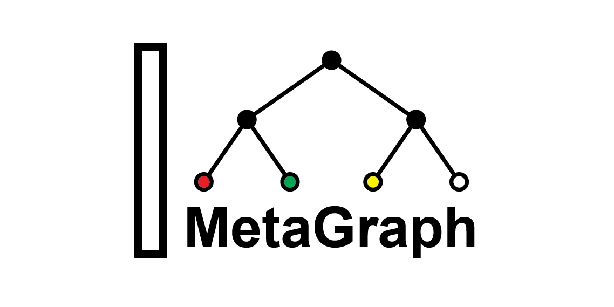
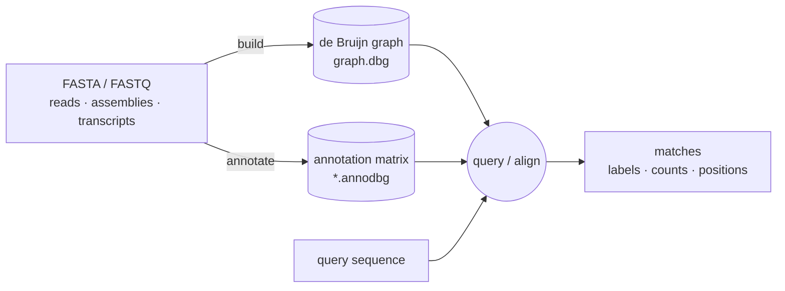

<p align="center">
  
</p>

[](#-quick-start)
[](#-quick-start)
[](https://github.com/ratschlab/metagraph/releases)
[](https://bioconda.github.io/recipes/metagraph/README.html)
[](https://bioconda.github.io/recipes/metagraph/README.html)
[](https://www.gnu.org/licenses/gpl-3.0)
[](https://doi.org/10.1038/s41586-025-09603-w)
[](https://metagraph.ethz.ch/static/docs/index.html)

**Scalable indexing and querying of annotated genome graphs — from a handful of genomes to petabase-scale sequence repositories.**

Think of MetaGraph as a search engine for sequencing data: index your reads or assemblies once, then query, align, or recover source positions in milliseconds.

A MetaGraph index has two components: a **de Bruijn graph** that stores all *k*-mers extracted from the input sequences, and an **annotation matrix** that links each *k*-mer to its source labels (sample, sequence header, expression level, position, …).



### What you can do

- 🔎 **Search public sequencing data.** Find a CRISPR spacer, AMR gene, or variant across 50+ PB of public reads via the hosted instance at [metagraph.ethz.ch](https://metagraph.ethz.ch).
- 📊 **Index your own cohort.** Build a *k*-mer index over an RNA-seq, metagenome, or pangenome cohort and recover per-sample expression or presence.
- 📍 **Lossless source recovery.** Index *k*-mer coordinates and queries come back with per-target hit positions — the index *is* the data.

### Features

- ⚡ **Scale.** Indexes with trillions of *k*-mers and millions of annotation labels; petabase-scale collections of public sequencing data have been indexed end-to-end.
- 🔢 **[k-mer counts](https://metagraph.ethz.ch/static/docs/quick_start.html#index-k-mer-counts).** Optional abundance payload — for expression levels, depth-of-coverage, or weighted graph cleaning.
- 📏 **[k-mer coordinates](https://metagraph.ethz.ch/static/docs/quick_start.html#index-k-mer-coordinates).** Optional position payload — losslessly encodes source sequences and returns per-target hit positions.
- 🧬 **Sequence alignment** against the full annotated graph, with sub-*k* seeding for arbitrarily short queries.
- 🧹 **Scalable graph cleaning** to strip sequencing errors out of very large de Bruijn graphs.
- 🔀 **[Differential assembly](https://metagraph.ethz.ch/static/docs/sequence_assembly.html#differential-assembly).** Extract sequences present in one group of samples and absent from another, driven by user-defined JSON rules.
- 🐍 **[Python API & HTTP server](https://metagraph.ethz.ch/static/docs/api.html).** Drive MetaGraph from Python or query a running instance over HTTP.

<details>
<summary>Design choices under the hood</summary>

- **Succinct data structures** — the default `succinct` (BOSS) graph representation uses only 2–4 bits per *k*-mer.
- **Memory-mapped loading** — near-zero RAM at query time and instant cold start; supported across most graph and annotation representations.
- **Batched algorithms** — operations are designed around the access patterns succinct structures favor (batched lookups over random access).
- **Modular representations** — multiple annotation formats (`ColumnCompressed`, `RowDiff<Multi-BRWT>`, `RowSparse`, `Rainbowfish`, plus count- and coordinate-aware variants) trade compression vs. query speed; pick the one that fits your scale.
- **Custom alphabets** — `{A,C,G,T}`, `{A,C,G,T,N}`, case-sensitive DNA, protein, or compile-time custom alphabets.
- **Extensible interfaces** — adding a new index representation requires little code overhead.

</details>

> 📖 **Full documentation:** <https://metagraph.ethz.ch/static/docs/index.html>
> &nbsp; · &nbsp; Offline docs: [`metagraph/docs/source`](metagraph/docs/source)

## 🌐 MetaGraph Online

Try MetaGraph without installing anything: <https://metagraph.ethz.ch> hosts a public search engine over 50+ petabases of DNA, RNA, and protein sequences, indexing SRA, ENA, DRA, RefSeq, UniProt, and more. Paste a query sequence at the top of the page and pick which indexed datasets to search against.

## 🚀 Quick start

### 1. Install

```bash
conda create -n metagraph python
conda activate metagraph
conda install -c bioconda -c conda-forge metagraph
pip install --force-reinstall "git+https://github.com/ratschlab/metagraph.git#subdirectory=metagraph/workflows"
```

`metagraph` ships the compiled binary; `metagraph-workflows` is the Python wrapper that drives the full build pipeline.

### 2. Build an index

Clone the repo for the bundled test data, then build:

```bash
git clone https://github.com/ratschlab/metagraph.git && cd metagraph
metagraph-workflows build <(ls metagraph/tests/data/*.fa) -o out/ --primary
```

`--primary` builds a *primary* graph — one strand kept per *k*-mer pair, about half the size of indexing both strands; recommended for DNA data. The positional argument accepts a file list (one path per line), a directory, or — as above — process substitution.

For real workloads, supply your own sample list and a hardware budget:

```bash
metagraph-workflows build samples.txt -o out/ --primary \
  -p 34 --mem-gb 70 --disk-swap-dir /scratch/swap
```

Per-stage memory caps, thread packing, and BRWT parameters are derived from the budget. See `metagraph-workflows build --help` for all options.

Outputs: `graph.dbg` (the de Bruijn graph), `graph_small.dbg` (a more compressed, slower-to-load representation of the same graph), and `graph.relax.row_diff_brwt.annodbg` (the default `RowDiff<Multi-BRWT>` annotation). Internally this chains `metagraph build → annotate → transform_anno --anno-type row_diff → transform_anno --anno-type *_brwt` — see [the pipeline docs](https://metagraph.ethz.ch/static/docs/quick_start.html) for each stage.

### 3. Query

Query the index (any fasta works as input — the bundled test data is fine for a smoke test):

```bash
metagraph query --query-mode matches -p 8 \
    -i out/graph.dbg -a out/graph.relax.row_diff_brwt.annodbg \
    metagraph/tests/data/transcripts_100.fa
```

### What next

- 🧬 **Align reads** instead of querying — see [Minimal example](#-minimal-example) and `metagraph align --help`.
- 🐍 **Drive from Python or HTTP** — load the index with `metagraph server_query`, then call it from the [Python API](https://metagraph.ethz.ch/static/docs/api.html).
- 🔀 **Differential assembly** — extract sequences present in some labels and absent in others (see [More recipes](#-more-recipes) below).
- 📚 **Full docs** — <https://metagraph.ethz.ch/static/docs/index.html>.

## 💡 Minimal example

For a guaranteed-working end-to-end demo with the bundled test data, using `metagraph` directly (no workflow wrapper, no row-diff/BRWT — just the column-compressed annotation, which is plenty at this scale).

A *label* is whatever tag you want each *k*-mer associated with — a filename, a fasta header, or a custom string. `--anno-header` below produces one label per fasta record (1000 labels for 1000 transcripts).

```bash
cd metagraph/tests/data

# 1. Build a de Bruijn graph (k-mer index) with k=31
metagraph build -v -p 4 -k 31 -o transcripts_1000 transcripts_1000.fa

# 2. Construct an annotation matrix linking each k-mer to its source label.
metagraph annotate -v -p 4 -i transcripts_1000.dbg --anno-header \
                   -o transcripts_1000 transcripts_1000.fa

# 3. Query: for each query sequence, report all labels whose k-mers cover ≥80% of it.
metagraph query -i transcripts_1000.dbg -a transcripts_1000.column.annodbg \
                --min-kmers-fraction-label 0.8 \
                transcripts_1000.fa

# 4. Print graph + annotation stats.
metagraph stats -a transcripts_1000.column.annodbg transcripts_1000.dbg
```

Outputs:
- `transcripts_1000.dbg` — the de Bruijn graph (613,859 *k*-mers at k=31).
- `transcripts_1000.column.annodbg` — annotation in the `ColumnCompressed` format (1,000 labels).

Sample query output (tab-separated: query index, query header, matching labels joined by `:`):

```
3   ENST00000619216.1|...|MIR6859-1|68|miRNA|   ENST00000619216.1|...|MIR6859-1|68|miRNA|:ENST00000612080.1|...|MIR6859-2|68|miRNA|
```

Here `MIR6859-1` matches both itself *and* its paralog `MIR6859-2` — they share enough *k*-mers to clear the 80% threshold.

For larger indexes, the column-compressed annotation gets transformed into more compact representations (`RowDiff<Multi-BRWT>`, `RowDiff<RowSparse>`, `Rainbowfish`, …). The `metagraph-workflows build` command in [Quick start](#-quick-start) chains those transforms automatically.

## 🔧 More recipes

<details>
<summary>Direct CLI: align / assemble / differential assembly / stats</summary>

```bash
# Build a de Bruijn graph from a fasta (single sample)
metagraph build -v -p 8 -k 31 --mem-cap-gb 10 -o graph data.fa.gz

# Build using disk swap (limits RAM at the cost of disk I/O)
metagraph build -v -p 8 -k 31 --mem-cap-gb 10 --disk-swap /scratch/swap -o graph data.fa.gz

# Annotate a graph with file-based labels (one label per input file)
metagraph annotate -v -p 8 --anno-filename -i graph.dbg -o annotation data.fa.gz

# Align reads against a graph
metagraph align -v -i graph.dbg query.fa

# Assemble unitigs from a graph
metagraph assemble -v graph.dbg -o assembled.fa --unitigs

# Differential assembly — JSON rules define which label groups must be present vs. absent.
# Sample rule files: metagraph/tests/data/example.diff.json, example_simple.diff.json.
metagraph assemble -v graph.dbg --unitigs \
    -a annotation.column.annodbg \
    --diff-assembly-rules diff_assembly_rules.json \
    -o diff_assembled.fa

# Stats — graph only, annotation only, or both
metagraph stats graph.dbg
metagraph stats -a annotation.column.annodbg
metagraph stats -a annotation.column.annodbg graph.dbg
```

See the [online docs](https://metagraph.ethz.ch/static/docs/index.html) for the full subcommand reference, alphabet builds, and the row-diff / BRWT clustering pipeline.

</details>

<details>
<summary>Build from KMC k-mer counters (e.g., to filter low-abundance k-mers)</summary>

[KMC](https://github.com/refresh-bio/KMC) is an extremely efficient *k*-mer counter that can pre-process inputs and filter by abundance. Build a graph from *k*-mers occurring at least 5 times:

```bash
K=31
# Count k-mers with KMC (drops k-mers with abundance < 5)
./KMC/kmc -ci5 -t4 -k$K -m5 -fq input.fastq.gz input.cutoff_5 ./KMC

# Build the graph directly from the KMC counter
metagraph build -v -p 4 -k $K -o graph input.cutoff_5.kmc_pre
```

Add `--count-kmers` to keep the KMC abundance counts as a weight vector alongside the graph (`graph.dbg.weights`). The weighted graph is the input for [`metagraph clean`](https://metagraph.ethz.ch/static/docs/quick_start.html#graph-cleaning) and for indexing *k*-mer counts.

</details>

<details>
<summary>Common query flags</summary>

```bash
# Filter labels with low k-mer coverage (default 0.7)
metagraph query --min-kmers-fraction-label 0.8 ...

# Pick a label-list separator other than ":"
metagraph query --labels-delimiter ", " ...

# Per-k-mer presence/absence bitmask per matching label
metagraph query --query-mode signature ...

# Indexed k-mer counts (requires count-aware annotation, see online docs)
metagraph query --query-mode counts ...

# k-mer coordinates / per-target positions (requires coordinate-aware annotation)
metagraph query --query-mode coords ...

# Server mode (Python API / HTTP queries)
metagraph server_query -i graph.dbg -a annotation.annodbg --port 5555 --parallel 8
```

</details>

For manual Multi-BRWT clustering (linkage trees, memory formulas, column-count tradeoffs), see [the annotation-transform docs](https://metagraph.ethz.ch/static/docs/quick_start.html#transform-annotation).

## 📦 Install

The recommended conda + pip install is covered in [Quick start](#-quick-start). MetaGraph runs on Linux and macOS (x86-64 and arm64); the Minimal example needs < 1 GB RAM, while petabase-scale builds use disk swap and 70+ GB. The bioconda install gives a single `metagraph` binary built for the `DNA` alphabet — for `DNA5`, `Protein`, or custom alphabets, use the Docker image (which bundles all three variants) or build from source.

### 🐳 Docker

```bash
docker pull ghcr.io/ratschlab/metagraph:master
docker run -v ${HOME}:/mnt ghcr.io/ratschlab/metagraph:master \
    metagraph build -v -k 10 -o /mnt/transcripts_1000 /mnt/transcripts_1000.fa
```

Replace `${HOME}` with the host directory you want to expose under `/mnt`. The default image targets the `DNA` alphabet `{A,C,G,T}`; the `DNA5` and `Protein` variants are invoked as `metagraph_DNA5` / `metagraph_Protein` from the same image. All published images are listed [here](https://github.com/ratschlab/metagraph/pkgs/container/metagraph).

<details>
<summary>Advanced Docker usage</summary>

Inspect what's mounted in the container:

```bash
docker run -v ${HOME}:/mnt ghcr.io/ratschlab/metagraph:master ls /mnt
```

Run the `DNA5` / `Protein` variants:

```bash
docker run -v ${HOME}:/mnt ghcr.io/ratschlab/metagraph:master \
    metagraph_Protein build -v -k 10 -o /mnt/graph /mnt/protein.fa
```

Drop into an interactive shell for multi-step workflows:

```bash
docker run -it --entrypoint /bin/bash -v ${HOME}:/mnt ghcr.io/ratschlab/metagraph:master
# inside container:
metagraph --version
metagraph build -v -k 31 -o /mnt/graph /mnt/data.fa.gz
```

</details>

### 🛠️ Install from sources

See the [installation guide](https://metagraph.ethz.ch/static/docs/installation.html#install-from-source) for custom alphabet / debug builds.

## 🤝 Contributing

Development notes — docker build, Makefile shortcuts, and the release process — live in [CONTRIBUTING.md](CONTRIBUTING.md).

## 📝 Citation

If MetaGraph or its index resources are useful in your work, please cite:

> Karasikov M, Mustafa H, Danciu D, Kulkov O, Zimmermann M, Barber C, Rätsch G, Kahles A. Efficient and accurate search in petabase-scale sequence repositories. *Nature*. 2025;647: 1036–1044. <https://www.nature.com/articles/s41586-025-09603-w>

<details>
<summary>BibTeX</summary>

```bibtex
@article{karasikov2025metagraph,
  title={Efficient and accurate search in petabase-scale sequence repositories},
  author={Karasikov, Mikhail and Mustafa, Harun and Danciu, Daniel and Kulkov, Oleksandr and Zimmermann, Marc and Barber, Christopher and R{\"a}tsch, Gunnar and Kahles, Andr{\'e}},
  journal={Nature},
  volume={647},
  number={8091},
  pages={1036--1044},
  year={2025},
  publisher={Nature Publishing Group},
  doi={10.1038/s41586-025-09603-w}
}
```
</details>

## ⚖️ License

MetaGraph is distributed under the GPLv3 License (see [LICENSE](LICENSE)). See also [AUTHORS](AUTHORS) and [COPYRIGHTS](COPYRIGHTS).
